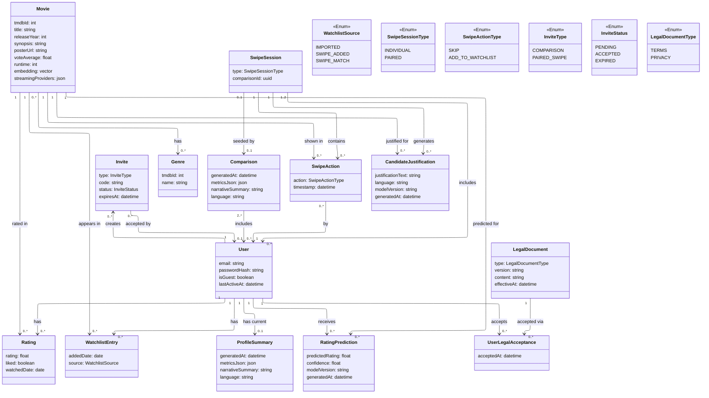

# Data Model — Ukinory

This document describes the core entities of Ukinory and how they relate to each other.

## Diagram

## Entities

**User** — either a guest or a registered account, distinguished by `isGuest`. Guests have `email`/`passwordHash` set to null and are created implicitly on first visit; registering (or "claiming" a guest session) simply fills in those fields on the same row and flips `isGuest` to `false`, so no other entity needs to know or care which kind of user it's dealing with.

**Invite** — a shareable, expiring code that lets one user (guest or registered) bring another into a `Comparison` or a `PAIRED` `SwipeSession`, without needing a public directory of users to search. `type` says what the invite is for; once `status` becomes `ACCEPTED`, the backend creates the actual `Comparison`/`SwipeSession`, linking the invite's creator and acceptor as its participants. No target reference is stored on `Invite` itself — the target doesn't exist yet at invite-creation time (it's only created on acceptance), so there's nothing for it to point to beforehand.

**Movie** — a title enriched from TMDb, keyed by `tmdbId`. Cached locally after the first lookup so repeated references (across ratings, watchlist, swipes, matches, predictions) don't require new API calls. Stores its synopsis `embedding` as a `pgvector` column, and `streamingProviders` as a JSON blob of regional availability. No `voteCount`/`adult` columns are added here — see the FR-B21 design note below for why.

**Rating** — a single Letterboxd entry connecting a user to a movie they've watched, sourced from `ratings.csv` and taking the watched date from `diary.csv` and checking whether it was liked or not from `liked/films.csv`.

**WatchlistEntry** — a movie a user wants to watch. `source` distinguishes entries imported directly from `watchlist.csv` (`IMPORTED`), added through individual swiping (`SWIPE_ADDED`), or added automatically because of a paired-session match (`SWIPE_MATCH`) — only the latter two need to be exported back out for re-import into Letterboxd.

**ProfileSummary** — the generated taste profile for a `User`: computed metrics plus the LLM-written narrative summary. Regenerated (and overwritten) each time a user re-imports an updated export.

**Comparison** — the result of comparing two or more users, reached via an accepted `Invite`. `Comparison` holds the combined metrics and narrative.

**SwipeSession** — a swipe session of either `INDIVIDUAL` type (one participant) or `PAIRED` type (currently two participants). A `PAIRED` session can optionally reference the `Comparison` that seeded its shared candidate pool and joint justifications.

**SwipeAction** — a single swipe decision (skip or add to watchlist) by one participant within a session, on a candidate movie. Used to avoid re-showing the same candidate, to detect matches in paired sessions (see the FR-B39 design note below), and as training feedback for the ML re-ranking model.

**CandidateJustification** — the LLM-generated justification text shown alongside a candidate movie in a swipe session, closing the FR-B32/FR-B37 gap ("the generated text isn't stored anywhere"). It's tied to a specific session and movie (via its relations to `SwipeSession` and `Movie`) rather than living on `SwipeAction`, because the justification is generated and shown *before* a swipe decision is made, and — for `PAIRED` sessions — is a single joint text shared by both participants rather than something to duplicate per user. This makes it auditable/cacheable (same session won't re-prompt the LLM for a candidate it already justified) and gives FR-B43 (language) and the model version something concrete to record per justification.

**RatingPrediction** — the output of the per-user ML rating-prediction model for a given movie: a predicted rating, which model version produced it, and when. Kept separate from `Rating` (actual Letterboxd ratings) so predicted and real data are never conflated.

**LegalDocument** — versioned content for the Terms and Conditions and the Privacy Policy (`type` distinguishes the two), closing the FR-B09 gap. Each edit to either document is a new row rather than an in-place update, so historical versions stay available for exactly the reason FR-B09 exists: knowing which text a given acceptance record refers to, even after the content is later revised.

**UserLegalAcceptance** — the record that a specific registered `User` accepted a specific `LegalDocument` version at a specific time, closing the FR-B08 gap. Created only at registration (or when claiming a guest account), never for guest sessions — matching FR-B08's requirement that guests see the documents non-blockingly rather than being forced to accept them. A guest who later claims their account produces the acceptance row at that point, same as any other registration.

## Design notes

- **Surrogate `id` keys, plain `createdAt` audit timestamps, and stored foreign keys are all omitted from the class bodies.** Every entity is assumed to have a primary key, and every relationship shown as an arrow is assumed to be backed by whatever foreign key(s) implementing it requires (e.g. the `SwipeSession "1" --> "0..*" SwipeAction` arrow implies a `sessionId` column on `SwipeAction` at the physical level) — repeating that as an attribute on the class would just restate the arrow in text form. The one exception is `SwipeAction "0..*" --> "1" User : by`: unlike, say, `Rating` or `WatchlistEntry` (where the existing `User`/`Movie` arrows already say everything the old `userId`/`movieId` fields said), nothing else in the diagram captured *which* participant made a given swipe, so that arrow was added rather than just dropping the field with no trace of it. What's kept as an actual attribute is anything that's actually load-bearing for a requirement and isn't implied by any arrow: `User.lastActiveAt` (drives the FR-B10 cleanup job), `Invite.expiresAt` (drives FR-B13), `ProfileSummary/Comparison/CandidateJustification/RatingPrediction.generatedAt` (freshness/regeneration logic, e.g. FR-B04's re-import overwrite), `LegalDocument.effectiveAt` and `UserLegalAcceptance.acceptedAt` (FR-B09's versioning). The rule of thumb: if a field either wouldn't break any FR by being removed, or is already implied by a drawn relation, it isn't in the diagram.
- **`User.isGuest`** is the entire guest/registered distinction — every other entity (`Rating`, `WatchlistEntry`, `Comparison`, `SwipeSession`, etc.) references a plain `User` id and behaves identically either way. This is what makes "claiming" an account a one-row update instead of a data migration.
- **`Invite`** decouples "how two people find each other" from what happens once they do — the same entity covers both comparisons and paired swipe sessions via `type`, and expiring unused invites (`status: EXPIRED`) keeps stale codes from being usable indefinitely.
- **`Movie.embedding`** and **`Movie.streamingProviders`** are computed/fetched once per movie and reused across all users — no per-user recalculation needed.
- **FR-B21's adult/vote-count filter is applied as a TMDb query parameter at ingestion time (FR-B20), not as a stored `Movie` column.** The seeding job calls TMDb's discover endpoint with `include_adult=false` and a `vote_count.gte` threshold, so a title that fails the filter is simply never fetched or inserted — there's nothing to "exclude" locally after the fact. This deliberately does **not** apply to movies that arrive via a user's own Letterboxd import (FR-B15): those are the user's real watch history and must never be filtered out just because a title is unrated or adult-flagged, which is exactly why this lives in the seeding pipeline (FR-B20/23) rather than as a general `Movie` attribute. `voteAverage` stays as a stored column since it's actually displayed to the user; `voteCount`/`adult` are query inputs, not display data, so they don't need a home in the schema.
- **`SwipeSession.type`** unifies individual and paired swiping under one model, so the swipe/matching logic doesn't need two separate code paths.
- **`SwipeSession.comparisonId`** is what lets a paired session directly reuse the compatibility computation (candidate pool + joint justification) from an existing `Comparison`, instead of recomputing it from scratch — modeled as the `SwipeSession "0..1" --> "0..1" Comparison : seeded by` relation rather than a listed field, per the note above.
- **`Comparison`–`User` and `SwipeSession`–`User` are drawn as direct many-to-many associations** (`"2..*"` and `"1..2"`), not as an explicit join-table class. At the relational level this still becomes a join table either way — SQL has no way to express "a row relates to a variable number of rows elsewhere" without one — so nothing about the physical schema changes. What changes is that the *diagram* treats that table as an implementation detail (e.g. `comparison_participants(comparisonId, userId)`, `swipe_session_participants(sessionId, userId)`) rather than a first-class documented entity, since today neither table needs any column beyond the two foreign keys. If a participant-level attribute is ever needed (joined-at, role, invited-by), that's the point at which it earns a spot back in this document as its own entity.
- **`CandidateJustification`** is deliberately scoped to `(sessionId, movieId)` rather than to a single user, so a `PAIRED` session's joint justification is generated and stored once and read by both participants, and so re-showing a candidate in the same session (e.g. after a page refresh) doesn't trigger a second LLM call.
- **Match detection (FR-B39) is a derived condition, not a stored entity.** A match is just: within one `PAIRED` `SwipeSession`, do both participants have a `SwipeAction` row for the same movie with `action = ADD_TO_WATCHLIST`? That's a query over `SwipeAction`, checked whenever a swipe is recorded. When it's true, the backend inserts the two `WatchlistEntry` rows (`source: SWIPE_MATCH`) and pushes a transient real-time event to both clients (FR-B38) — but nothing about "the match" itself needs its own row, since `SwipeAction` already has everything needed to reconstruct it later (e.g. for FR-B07's data export, "matches" are just `WatchlistEntry` rows with `source = SWIPE_MATCH`).
- **`LegalDocument`** keeps versioned content independent of any single acceptance — the same version can be (and is meant to be) referenced by many `UserLegalAcceptance` rows, and a new version doesn't invalidate old acceptance records, it just means new registrations point at a newer `documentId`.
- **`User.lastActiveAt`** is updated on every authenticated request (alongside token validation) and is what the guest-cleanup job (FR-B10) checks — a guest `User` (and everything cascading from it: ratings, watchlist, profile, swipes, matches) is deleted once `lastActiveAt` falls outside the inactivity window. Registered users are exempt from this cleanup regardless of `lastActiveAt`.

## Traceability Matrix

Maps each backend functional requirement to the entities it touches. Frontend requirements (FR-F) are omitted — they consume these same entities through the API rather than modifying the model directly. Business rules (RN-01/02/03) are intentionally left out for now. marks rows changed by this revision.

| Requirement | Involved UML entities | Relevant attributes/relations | Relation type | Notes |
|---|---|---|---|---|
| FR-B01: Immediate use as a guest | User | isGuest, lastActiveAt | Direct | Creates the row without email/passwordHash (`id` is assumed, not explicitly modeled) |
| FR-B02: Register with email/password | User | email, passwordHash, isGuest | Direct | — |
| FR-B03: Login → session token | User | email, passwordHash | Direct | The JWT itself isn't a persisted entity (stateless) |
| FR-B04: Claim guest session | User | email, passwordHash, isGuest | Direct | Update of the same row, not a data migration |
| FR-B04 (continued): keep history when claiming | Rating, WatchlistEntry, ProfileSummary, SwipeAction | Preserved via each entity's relation to `User` (not a stored FK column); past "matches" are kept as `WatchlistEntry` rows with `source = SWIPE_MATCH`, not as their own entity | Indirect | No change needed since the `User`'s `id` doesn't change |
| FR-B05: Validate token on every request | User | lastActiveAt | Direct | Updated on every authenticated call |
| FR-B06: Logout and account/data deletion | User + every entity related to it (Rating, WatchlistEntry, ProfileSummary, SwipeAction, RatingPrediction, UserLegalAcceptance) + the `comparison_participants`/`swipe_session_participants` join tables | Cascading delete via each entity's relation to `User` | Direct | `UserLegalAcceptance` added to the cascade, now that it exists |
| FR-B07: Export all data (JSON) | User, Rating, WatchlistEntry, ProfileSummary, SwipeAction, RatingPrediction, UserLegalAcceptance | Aggregated via each entity's relation to `User` | Indirect | Aggregated read via the `User` relation, creates no new entity; the user's "matches" are read as a subset of their `WatchlistEntry` rows |
| FR-B08: Terms/Privacy acceptance at registration | LegalDocument, UserLegalAcceptance | acceptedAt (the accepting user and the accepted document are captured by relations, not stored fields) | Direct | A `UserLegalAcceptance` row is created at registration (or when claiming a guest account). No row is created for guest sessions: the documents are only shown non-blockingly |
| FR-B09: Versioned Terms/Privacy content | LegalDocument | type, version, content, effectiveAt | Direct | Every edit to the text creates a new row/version instead of overwriting; `UserLegalAcceptance`'s relation to `LegalDocument` fixes which version each user accepted |
| FR-B10: Automatic deletion of inactive guests | User | isGuest, lastActiveAt | Direct | Cleanup job; cascade same as FR-B06 |
| FR-B11: Generate invite link | Invite, User | type, code, status, expiresAt | Direct | The creator is captured by the `User "1" --> "0..*" Invite : creates` relation, not a stored field |
| FR-B12: Accept invite link | Invite | status | Direct | The acceptor is captured by the `Invite "0..*" --> "0..1" User : accepted by` relation; accepting indirectly triggers the creation of `Comparison`/`SwipeSession` and their participant rows |
| FR-B13: Expire unused invites | Invite | status = EXPIRED | Direct | — |
| FR-B14: Import Letterboxd export | Rating, WatchlistEntry | source (WatchlistEntry); rating/liked/watchedDate (Rating) | Direct | Ownership by the importing user is captured by each entity's relation to `User`, not a stored field |
| FR-B15: Match to a TMDb movie | Movie | tmdbId | Direct | Creates the row if it doesn't already exist in the cache |
| FR-B16: Fetch full TMDb metadata | Movie | title, genres, synopsis, posterUrl, voteAverage, runtime, streamingProviders | Direct | — |
| FR-B17: Handle TMDb rate limits | — | — | Not applicable | External API access logic, not data |
| FR-B18: Cache TMDb metadata | Movie | the whole row acts as the cache | Direct | — |
| FR-B19: Controlled ingestion errors | — | — | Not applicable | Error handling, not persistence |
| FR-B20: Seed the catalog from TMDb | Movie | bulk creation independent of any user | Direct | — |
| FR-B21: Exclude adult/unrated/low-vote titles | — | `include_adult=false`, `vote_count.gte=N` as parameters of the TMDb discover-endpoint call | Not applicable | No longer an attribute gap: the filter is applied when requesting the data from TMDb (FR-B20), `voteCount`/`adult` aren't stored on `Movie` or filtered after the fact. Doesn't apply to movies arriving via user import (FR-B15), which must never be filtered |
| FR-B22: Embeddings for seeded movies | Movie | embedding | Direct | — |
| FR-B23: Periodic catalog refresh | Movie | new/updated rows | Direct | — |
| FR-B24: Internal quantitative profile metrics | ProfileSummary | metricsJson | Direct | — |
| FR-B25: Embeddings of the user's watched synopses | Movie, Rating | embedding (Movie), joined via Rating | Indirect | Reuses the already-computed `Movie.embedding`; adds no attribute of its own |
| FR-B26: LLM-generated profile narrative | ProfileSummary | narrativeSummary | Direct | — |
| FR-B27: Expose only the narrative | ProfileSummary | narrativeSummary (metricsJson omitted) | Direct | — |
| FR-B28: Overlap/divergence metrics | Comparison | metricsJson | Direct | — |
| FR-B29: LLM-based joint recommendations | Comparison | narrativeSummary | Direct | — |
| FR-B30: Expose comparison result | Comparison | — | Direct | — |
| FR-B31: Candidate pool (individual) | Movie, Rating, WatchlistEntry, SwipeAction | embedding, exclusion of watched/already-swiped titles | Indirect | Combines several entities via a query; persists nothing new |
| FR-B32: Per-candidate justification (LLM) | CandidateJustification | justificationText, language, modelVersion | Direct | The generated text used to not be stored anywhere; now it's persisted per session/movie (via relations), auditable and cacheable |
| FR-B33: Record swipe action | SwipeAction | action, timestamp | Direct | Session, actor, and movie are captured by relations (`SwipeSession : contains`, `User : by`, `Movie : shown in`), not stored fields |
| FR-B34: Watchlist CSV for re-import | WatchlistEntry | source IN (SWIPE_ADDED, SWIPE_MATCH) | Direct | — |
| FR-B35: Start a paired swipe session | SwipeSession, User | type = PAIRED, direct "1..2" relation to User | Direct | — |
| FR-B36: Shared pool from compatibility | SwipeSession, Comparison | the `seeded by` relation to Comparison | Direct | — |
| FR-B37: Joint per-candidate justification | CandidateJustification | justificationText | Direct | Same entity as FR-B32; since it's related to a `SwipeSession` (not a user), one row serves as the joint justification for both participants. The `PAIRED` aspect comes from the related session's `type` |
| FR-B38: Real-time connection per session | SwipeSession, SwipeAction | the session's (assumed) id is used as the room, SwipeAction is what gets broadcast | Direct (partial) | The connection itself isn't a persisted entity; each incoming `SwipeAction` is broadcast to the other participant, and that broadcast is where the match check happens |
| FR-B39: Match detection | SwipeAction, WatchlistEntry | action | Indirect | A match is a derived condition (two `SwipeAction` rows related to the same session and the same movie, both with `action = ADD_TO_WATCHLIST`), not its own entity; when detected, two `WatchlistEntry` rows are inserted (`source = SWIPE_MATCH`) |
| FR-B40: Per-user prediction model | RatingPrediction, Rating, Movie | predictedRating, embedding | Direct / Indirect | Direct on the output (`RatingPrediction`), indirect on the training data; user and movie are captured by relations |
| FR-B41: Cross-user collaborative filtering | RatingPrediction, Rating | every `Rating` row on the platform | Direct / Indirect | Same as FR-B40, but with platform-wide scope |
| FR-B42: Expose predictions | RatingPrediction | predictedRating, modelVersion | Direct | — |
| FR-B43: Language preference for LLM content | ProfileSummary, Comparison, CandidateJustification | narrativeSummary, language | Direct (partial) | The requested language is a request parameter; `CandidateJustification.language` persists it alongside the generated text to record which language each justification was generated in |
| FR-B44: Structured error format | — | — | Not applicable | Error handling, not data |