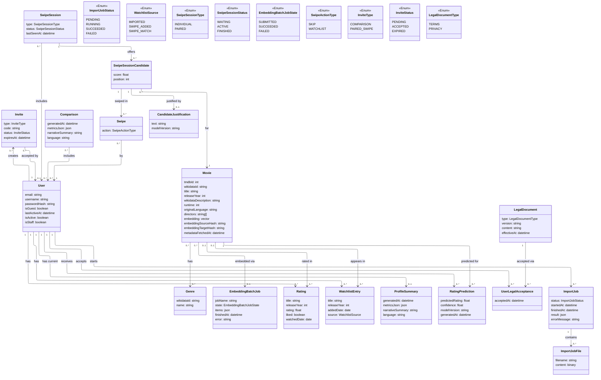

# Data Model — Ukinory

This document describes the core entities of Ukinory and how they relate to each other.

## Diagram

## Entities

**User** — either a guest or a registered account, distinguished by `isGuest`. Every `User`, guest or registered, also has a `username`: guests get one auto-generated at creation (`guest_<random>`), which doubles as their login handle until they claim the account. Guests have `email`/`passwordHash` set to null and are created implicitly on first visit; registering (or "claiming" a guest session) simply fills in those fields on the same row and flips `isGuest` to `false`, so no other entity needs to know or care which kind of user it's dealing with. A DB-level check constraint enforces that only guests can have a null `email` — a registered `User` is never allowed to end up without one. `isActive`/`isStaff` are Django-auth boilerplate (account suspension, admin access) rather than product-level fields tied to any FR.

**Invite** — a shareable, expiring code that lets one user (guest or registered) bring another into a `Comparison` or a `PAIRED` `SwipeSession`, without needing a public directory of users to search. `type` says what the invite is for; once `status` becomes `ACCEPTED`, the backend creates the actual `Comparison`/`SwipeSession`, linking the invite's creator and acceptor as its participants. No target reference is stored on `Invite` itself — the target doesn't exist yet at invite-creation time (it's only created on acceptance), so there's nothing for it to point to beforehand.

**Movie** — anchored on its `tmdbId` (the id TMDb's search returns during matching, FR-B15), but with its descriptive fields sourced from Wikidata rather than TMDb: `title`, `releaseYear`, `wikidataDescription`, `runtime`, `originalLanguage`, `directors`, and its `genres` (via the M2M below) are looked up from Wikidata using `tmdbId` as the join key (a Wikidata item declares its TMDb id via the `P4947` property) and cached once per `tmdbId`, so repeated references — across ratings, watchlist entries, swipes, matches, and predictions — never re-trigger a Wikidata lookup. A row is only created once **both** a TMDb match *and* a corresponding Wikidata item are found; a `tmdbId` with no matching Wikidata item stores nothing and is instead recorded as matched-but-without-metadata (FR-B19), not as an error. `embeddingSourceHash`/`embeddingTargetHash` are new: a hash of the fields the embedding was built from and a hash of the embedding pipeline/prompt version, so a re-import or a pipeline change can detect "does this row's embedding need regenerating?" without recomputing it speculatively.

**Genre** — a movie genre as classified by Wikidata (`wikidataId`, e.g. `Q471839` for Science Fiction), reused across every `Movie` that shares it rather than duplicated per movie.

**EmbeddingBatchJob** — a new entity tracking one submitted batch-embedding job (`jobName` is the id from the embedding provider's batch API). `state` moves from `SUBMITTED` to `SUCCEEDED`/`FAILED`; `items` records what was submitted in the batch and `error` captures the failure reason when `state = FAILED`. Every `Movie` embedded through the batch pipeline points back at the job that produced it, so a failed or still-pending job's movies are identifiable without re-scanning `embeddingSourceHash`. This formalizes FR-B22/FR-B25's embedding generation as an asynchronous, batched, and auditable step, rather than an inline synchronous call per movie.

**Rating** — a single Letterboxd entry connecting a user to a movie they've watched, sourced from `ratings.csv` and taking the watched date from `diary.csv` and checking whether it was liked or not from `liked/films.csv`. `title`/`releaseYear` are now stored directly on the row (shared with `WatchlistEntry` via a common abstract base), not just implied through `movie` — since `movie` is nullable (an unmatched or metadata-less title, FR-B19), the entry needs its own identity independent of whether the `Movie` link resolved. The uniqueness constraint is `(user, title, releaseYear)` accordingly, not `(user, movie)`.

**WatchlistEntry** — a movie a user wants to watch. Same `title`/`releaseYear` treatment and uniqueness rationale as `Rating` above. `source` distinguishes entries imported directly from `watchlist.csv` (`IMPORTED`), added through individual swiping (`SWIPE_ADDED`), or added automatically because of a paired-session match (`SWIPE_MATCH`) — only the latter two need to be exported back out for re-import into Letterboxd.

**ProfileSummary** — the generated taste profile for a `User`: computed metrics plus the LLM-written narrative summary. Regenerated (and overwritten) each time a user re-imports an updated export.

**Comparison** — the result of comparing two or more users, reached via an accepted `Invite`. `Comparison` holds the combined metrics and narrative.

**SwipeSession** — a swipe session of either `INDIVIDUAL` type (one participant) or `PAIRED` type. `status` now tracks the session's lifecycle explicitly (defaulting to `WAITING`, e.g. for a paired session waiting on its second participant); `lastSeenAt` supports the real-time layer (FR-B38), tracking when the session was last active so stale/abandoned sessions can be identified. `users` is a plain many-to-many, with no `(session, user)` role or join-date captured — same "not worth a first-class entity yet" reasoning as the `Comparison`/`SwipeSession` participant tables below. **Note:** the direct `comparisonId` link to `Comparison` described in the original design is not present on the current model — a paired session's candidate pool is no longer necessarily seeded from a stored `Comparison` row (see the FR-B36 note under Design notes).

**SwipeSessionCandidate** — new entity, and the biggest structural change in this revision: the candidate pool for a session, which used to be computed on the fly and never persisted (see the old FR-B31 note, "persists nothing new"), is now materialized as its own row per `(session, movie)` pair, with a `score` (the ranking signal used to build the pool) and a `position` (its fixed display order within the session, unique per session). Persisting the pool makes it stable across page refreshes/reconnects, gives `Swipe` and `CandidateJustification` something concrete to attach to instead of a loose `(session, movie)` pair, and means re-ranking logic only has to run once per session rather than on every request.

**Swipe** (renamed from `SwipeAction`) — a single swipe decision (skip or add to watchlist) by one participant, on a specific `SwipeSessionCandidate` rather than directly on a `Movie`. Since a `SwipeSessionCandidate` is already unique per `(session, movie)`, this is equivalent in what it can express to the old `(session, user, movie)` shape, but goes through the candidate row instead. Used to avoid re-showing the same candidate, to detect matches in paired sessions (see the FR-B39 design note below), and as training feedback for the ML re-ranking model.

**CandidateJustification** — the LLM-generated justification text shown alongside a candidate in a swipe session, closing the FR-B32/FR-B37 gap ("the generated text isn't stored anywhere"). It's now a strict one-to-one with `SwipeSessionCandidate` (rather than being tied to a `(SwipeSession, Movie)` pair as originally designed) — a natural fit now that the candidate itself is a stored row. For `PAIRED` sessions, it's still a single joint text shared by both participants rather than something duplicated per user, since it hangs off the shared `SwipeSessionCandidate`, not off either participant's `Swipe`. This makes it auditable/cacheable (same session won't re-prompt the LLM for a candidate it already justified). **Gap:** the current model only stores `text` and `modelVersion` — the `language` field called for by FR-B43 (recording which language a given justification was generated in) isn't present yet.

**RatingPrediction** — the output of the per-user ML rating-prediction model for a given movie: a predicted rating, which model version produced it, and when. Kept separate from `Rating` (actual Letterboxd ratings) so predicted and real data are never conflated.

**LegalDocument** — versioned content for the Terms and Conditions and the Privacy Policy (`type` distinguishes the two), closing the FR-B09 gap. Each edit to either document is a new row rather than an in-place update, so historical versions stay available for exactly the reason FR-B09 exists: knowing which text a given acceptance record refers to, even after the content is later revised.

**UserLegalAcceptance** — the record that a specific registered `User` accepted a specific `LegalDocument` version at a specific time, closing the FR-B08 gap. Created only at registration (or when claiming a guest account), never for guest sessions — matching FR-B08's requirement that guests see the documents non-blockingly rather than being forced to accept them. A guest who later claims their account produces the acceptance row at that point, same as any other registration.

**ImportJob** — tracks the asynchronous processing of a Letterboxd export uploaded by a `User`. `status` moves through `PENDING` → `RUNNING` → `SUCCEEDED`/`FAILED`; `startedAt`/`finishedAt` mark when processing began and ended, `result` holds the outcome of the import once it succeeds, and `errorMessage` captures the failure reason (truncated to 2000 characters) when it fails.

**ImportJobFile** — the uploaded export file(s) belonging to an `ImportJob`, stored as binary `content` alongside the original `filename`.

## Design notes

- **Surrogate `id` keys, plain `createdAt` audit timestamps, and stored foreign keys are all omitted from the class bodies.** Every entity is assumed to have a primary key, and every relationship shown as an arrow is assumed to be backed by whatever foreign key(s) implementing it requires (e.g. the `SwipeSession "1" --> "0..*" SwipeSessionCandidate` arrow implies a `sessionId` column on `SwipeSessionCandidate` at the physical level) — repeating that as an attribute on the class would just restate the arrow in text form. The one exception is `Swipe "0..*" --> "1" User : by`: unlike, say, `Rating` or `WatchlistEntry` (where the existing `User`/`Movie` arrows already say everything the old `userId`/`movieId` fields said), nothing else in the diagram captured *which* participant made a given swipe, so that arrow was added rather than just dropping the field with no trace of it. What's kept as an actual attribute is anything that's actually load-bearing for a requirement and isn't implied by any arrow: `User.lastActiveAt` (drives the FR-B10 cleanup job), `Invite.expiresAt` (drives FR-B13), `ProfileSummary/Comparison/RatingPrediction.generatedAt` (freshness/regeneration logic, e.g. FR-B04's re-import overwrite), `LegalDocument.effectiveAt` and `UserLegalAcceptance.acceptedAt` (FR-B09's versioning). `CandidateJustification` no longer lists a `generatedAt` — the current model relies on the inherited `createdAt` for that, same as any other entity, rather than a dedicated field. The rule of thumb: if a field either wouldn't break any FR by being removed, or is already implied by a drawn relation, it isn't in the diagram.

- **`User.isGuest`** is the entire guest/registered distinction — every other entity (`Rating`, `WatchlistEntry`, `Comparison`, `SwipeSession`, etc.) references a plain `User` id and behaves identically either way. This is what makes "claiming" an account a one-row update instead of a data migration.

- **`Invite`** decouples "how two people find each other" from what happens once they do — the same entity covers both comparisons and paired swipe sessions via `type`, and expiring unused invites (`status: EXPIRED`) keeps stale codes from being usable indefinitely.

- **`Movie.embedding`** is computed once per movie from its full set of stored fields (`title`, `wikidataDescription`, `genres`, `directors`, `originalLanguage`) rather than from `wikidataDescription` alone, and reused across all users — no per-user recalculation needed. `posterUrl`, `voteAverage`, and streaming-provider availability are fetched fresh from TMDb at display time rather than cached on `Movie`. `embeddingSourceHash`/`embeddingTargetHash` make that recomputation idempotent: if neither the source fields nor the embedding pipeline have changed since the last run, the movie is skipped rather than re-embedded.

- **Embedding generation is now an explicit batch pipeline (`EmbeddingBatchJob`), not an inline step.** Movies needing an embedding are grouped and submitted together to the embedding provider's batch API; each `Movie.embeddingBatch` points at the job that (will) produce its embedding, and the job's `state` is polled/updated until it resolves. This is a scaling change from the original design, where embedding generation wasn't modeled as its own entity at all — it matters for FR-B22 (seeded catalog) and FR-B25 (per-user watched-movie embeddings) alike, since both funnel through the same pipeline.

- **Movie metadata resolution happens in two decoupled steps.** FR-B15 resolves a TMDb match (search by title/year) for every imported or seeded title; only the subset whose `tmdbId` isn't already cached proceeds to FR-B16, where Wikidata metadata for *every outstanding `tmdbId` in that batch* is resolved together — one (or a handful of, for very large batches) SPARQL request instead of one request per movie.

- **`Rating`/`WatchlistEntry` can exist without a linked `Movie`.** A Letterboxd entry that TMDb can't match at all (FR-B15), or that matches a `tmdbId` with no Wikidata coverage (FR-B16), is still recorded — a user's watch history must never be silently dropped just because enrichment failed — just with `movieId` left null. This is also why `title`/`releaseYear` now live directly on `Rating`/`WatchlistEntry` (via a shared abstract base) rather than only being reachable through `movie`: without them stored on the row itself, an unmatched entry would have no stable identity at all, and the `(user, title, releaseYear)` uniqueness constraint wouldn't be expressible.

- **`SwipeSession.type`** unifies individual and paired swiping under one model, so the swipe/matching logic doesn't need two separate code paths. **`SwipeSession.status`** and **`SwipeSession.lastSeenAt`** are new: `status` gives the session an explicit lifecycle (e.g. `WAITING` for a paired session's second participant) instead of inferring it from participant count, and `lastSeenAt` gives the real-time layer (FR-B38) a way to tell an abandoned session from a live one.

- **Gap: the `SwipeSession → Comparison` link ("seeded by") from the original design isn't present on the current `SwipeSession` model.** FR-B36 calls for a paired session's candidate pool to be ranked using the combined compatibility logic from `Comparison`, but nothing on `SwipeSession` currently records which `Comparison` (if any) seeded it. Either that reuse happens without a stored reference (the pool is computed from the two users' data at session-creation time and then persisted onto `SwipeSessionCandidate`, with no ongoing link back to the `Comparison` row), or the wiring for FR-B36 is simply still pending — worth confirming with whoever owns the paired-session code.

- **`Comparison`–`User` and `SwipeSession`–`User` are drawn as direct many-to-many associations**, not as an explicit join-table class. At the relational level this still becomes a join table either way — SQL has no way to express "a row relates to a variable number of rows elsewhere" without one — so nothing about the physical schema changes. What changes is that the *diagram* treats that table as an implementation detail (e.g. `comparison_participants(comparisonId, userId)`, `swipe_session_participants(sessionId, userId)`) rather than a first-class documented entity, since today neither table needs any column beyond the two foreign keys. If a participant-level attribute is ever needed (joined-at, role, invited-by), that's the point at which it earns a spot back in this document as its own entity. Note that `SwipeSession`'s M2M is now unbounded at the DB level (no `"1..2"` constraint as originally drawn) — capping a paired session at two participants, if still desired, is enforced in application logic rather than the schema.

- **`SwipeSessionCandidate` is the standout structural change in this revision.** The original design treated a session's candidate pool as ephemeral — computed by a query, never stored (see the old FR-B31 note). The actual implementation persists it: one row per `(session, movie)`, carrying the `score` that ranked it and a `position` that fixes its display order, both enforced unique per session. This is what `Swipe` and `CandidateJustification` now attach to, instead of a loose `(session, movie)` pair — a session's candidate list becomes stable and independently queryable (e.g. "what did we already show this session") rather than something recomputed on every request.

- **`CandidateJustification`** is now a strict one-to-one with `SwipeSessionCandidate`, so a `PAIRED` session's joint justification is generated and stored once and read by both participants, and re-showing a candidate in the same session (e.g. after a page refresh) doesn't trigger a second LLM call — same intent as the original design, just attached to the candidate row instead of a `(sessionId, movieId)` pair now that one exists.

- **Match detection (FR-B39) is still a derived condition, not a stored entity — but now derived one level down.** A match is: within one `PAIRED` `SwipeSession`, does the same `SwipeSessionCandidate` have a `Swipe` row from each participant, both with `action = ADD_TO_WATCHLIST`? That's a query over `Swipe` (joined through `candidate`), checked whenever a swipe is recorded. When it's true, the backend inserts the two `WatchlistEntry` rows (`source: SWIPE_MATCH`) and pushes a transient real-time event to both clients (FR-B38) — but nothing about "the match" itself needs its own row, since `Swipe` + `SwipeSessionCandidate` already have everything needed to reconstruct it later (e.g. for FR-B07's data export, "matches" are just `WatchlistEntry` rows with `source = SWIPE_MATCH`).

- **`LegalDocument`** keeps versioned content independent of any single acceptance — the same version can be (and is meant to be) referenced by many `UserLegalAcceptance` rows, and a new version doesn't invalidate old acceptance records, it just means new registrations point at a newer `documentId`. This is now enforced at the code level, not just by convention: an existing `LegalDocument` row raises on `save()` if it's already persisted, so the only way to change published Terms/Privacy content is to create a new versioned row.

- **`User.lastActiveAt`** is updated on every authenticated request (alongside token validation) and is what the guest-cleanup job (FR-B10) checks — a guest `User` (and everything cascading from it: ratings, watchlist, profile, swipes, matches) is deleted once `lastActiveAt` falls outside the inactivity window. Registered users are exempt from this cleanup regardless of `lastActiveAt`.

## Traceability Matrix

Maps each backend functional requirement to the entities it touches. Frontend requirements (FR-F) are omitted — they consume these same entities through the API rather than modifying the model directly. Business rules (RN-01/02/03) are intentionally left out for now.

| Requirement | Involved UML entities | Relevant attributes/relations | Relation type | Notes |
|---|---|---|---|---|
| FR-B01: Immediate use as a guest | User | isGuest, lastActiveAt, username | Direct | Creates the row without email/passwordHash; `username` is now auto-generated for guests rather than left implicit (`id` is assumed, not explicitly modeled) |
| FR-B02: Register with email/password | User | email, passwordHash, isGuest | Direct | — |
| FR-B03: Login → session token | User | email, passwordHash | Direct | The JWT itself isn't a persisted entity (stateless) |
| FR-B04: Claim guest session | User | email, passwordHash, isGuest | Direct | Update of the same row, not a data migration |
| FR-B04 (continued): keep history when claiming | Rating, WatchlistEntry, ProfileSummary, Swipe | Preserved via each entity's relation to `User` (not a stored FK column); past "matches" are kept as `WatchlistEntry` rows with `source = SWIPE_MATCH`, not as their own entity | Indirect | No change needed since the `User`'s `id` doesn't change. Entity renamed from `SwipeAction` to `Swipe` |
| FR-B05: Validate token on every request | User | lastActiveAt | Direct | Updated on every authenticated call |
| FR-B06: Logout and account/data deletion | User + every entity related to it (Rating, WatchlistEntry, ProfileSummary, Swipe, RatingPrediction, UserLegalAcceptance) + the `comparison_participants`/`swipe_session_participants` join tables | Cascading delete via each entity's relation to `User` | Direct | `UserLegalAcceptance` added to the cascade, now that it exists. `SwipeAction` renamed to `Swipe` |
| FR-B07: Export all data (JSON) | User, Rating, WatchlistEntry, ProfileSummary, Swipe, RatingPrediction, UserLegalAcceptance | Aggregated via each entity's relation to `User` | Indirect | Aggregated read via the `User` relation, creates no new entity; the user's "matches" are read as a subset of their `WatchlistEntry` rows |
| FR-B08: Terms/Privacy acceptance at registration | LegalDocument, UserLegalAcceptance | acceptedAt (the accepting user and the accepted document are captured by relations, not stored fields) | Direct | A `UserLegalAcceptance` row is created at registration (or when claiming a guest account). No row is created for guest sessions: the documents are only shown non-blockingly |
| FR-B09: Versioned Terms/Privacy content | LegalDocument | type, version, content, effectiveAt | Direct | Every edit to the text creates a new row/version instead of overwriting — now enforced by the model itself, which raises on any update to an existing row; `UserLegalAcceptance`'s relation to `LegalDocument` fixes which version each user accepted |
| FR-B10: Automatic deletion of inactive guests | User | isGuest, lastActiveAt | Direct | Cleanup job; cascade same as FR-B06 |
| FR-B11: Generate invite link | Invite, User | type, code, status, expiresAt | Direct | The creator is captured by the `User "1" --> "0..*" Invite : creates` relation, not a stored field |
| FR-B12: Accept invite link | Invite | status | Direct | The acceptor is captured by the `Invite "0..*" --> "0..1" User : accepted by` relation; accepting indirectly triggers the creation of `Comparison`/`SwipeSession` and their participant rows |
| FR-B13: Expire unused invites | Invite | status = EXPIRED | Direct | — |
| FR-B14: Import Letterboxd export | Rating, WatchlistEntry | title, releaseYear (now stored on the row itself, not only implied via `movie`); source (WatchlistEntry); rating/liked/watchedDate (Rating) | Direct | Ownership by the importing user is captured by each entity's relation to `User`, not a stored field |
| FR-B15: Match to a TMDb movie | Movie | tmdbId | Direct | Only resolves the `tmdbId`; the row itself is created in FR-B16, once Wikidata metadata for that id is also found |
| FR-B16: Fetch descriptive metadata (from Wikidata) | Movie, Genre | title, releaseYear, wikidataDescription, runtime, originalLanguage, directors, genres | Direct | Creates the row; a `tmdbId` with no matching Wikidata item creates nothing (see FR-B19). `posterUrl`/`voteAverage`/`streamingProviders` are not part of this — they're fetched live from TMDb at display time instead. Field renamed `description` → `wikidataDescription` |
| FR-B17: Handle TMDb/Wikidata rate limits | — | — | Not applicable | External API access logic (TMDb search and Wikidata SPARQL alike), not data |
| FR-B18: Cache resolved metadata | Movie | the whole row acts as the cache, keyed by `tmdbId` | Direct | Every not-yet-cached `tmdbId` from an import is resolved together in one batched Wikidata request rather than one per movie |
| FR-B19: Controlled ingestion errors | — | — | Not applicable | Error handling, not persistence. TMDb-side failures are mapped to a controlled response; Wikidata-side failures during the batched metadata step are not yet mapped the same way — an open gap |
| FR-B20: Seed the catalog from TMDb | Movie | bulk creation independent of any user | Direct | — |
| FR-B21: Exclude adult/unrated/low-vote titles | — | `include_adult=false`, `vote_count.gte=N` as parameters of the TMDb discover-endpoint call | Not applicable | No longer an attribute gap: the filter is applied when requesting the data from TMDb (FR-B20), `voteCount`/`adult` aren't stored on `Movie` or filtered after the fact. Doesn't apply to movies arriving via user import (FR-B15), which must never be filtered |
| FR-B22: Embeddings for seeded movies | Movie, EmbeddingBatchJob | embedding, embeddingSourceHash, embeddingTargetHash, embeddingBatch | Direct | Now goes through an explicit batch job entity instead of an inline call; `state` on the job tracks the async result |
| FR-B23: Periodic catalog refresh | Movie | new/updated rows | Direct | — |
| FR-B24: Internal quantitative profile metrics | ProfileSummary | metricsJson | Direct | — |
| FR-B25: Embeddings of the user's watched movies | Movie, Rating | embedding (Movie), joined via Rating | Indirect | Reuses the already-computed `Movie.embedding` (built from the movie's full stored metadata, not just `wikidataDescription`); adds no attribute of its own |
| FR-B26: LLM-generated profile narrative | ProfileSummary | narrativeSummary | Direct | — |
| FR-B27: Expose only the narrative | ProfileSummary | narrativeSummary (metricsJson omitted) | Direct | — |
| FR-B28: Overlap/divergence metrics | Comparison | metricsJson | Direct | — |
| FR-B29: LLM-based joint recommendations | Comparison | narrativeSummary | Direct | — |
| FR-B30: Expose comparison result | Comparison | — | Direct | — |
| FR-B31: Candidate pool (individual) | Movie, Rating, WatchlistEntry, SwipeSessionCandidate | embedding, exclusion of watched/already-swiped titles; score, position | Indirect / Direct | Ranking is still computed by combining several entities via a query, but the resulting pool is now persisted as `SwipeSessionCandidate` rows instead of nothing |
| FR-B32: Per-candidate justification (LLM) | CandidateJustification | text, modelVersion | Direct | The generated text used to not be stored anywhere; now it's persisted one-to-one with `SwipeSessionCandidate`, auditable and cacheable. **Gap:** `language` is called for by FR-B43 but isn't a field on the current model |
| FR-B33: Record swipe action | Swipe | action | Direct | Renamed from `SwipeAction`. Session and movie are now reached indirectly through `candidate` (`SwipeSessionCandidate`) rather than a direct `Movie`/`SwipeSession` relation; actor is still captured directly (`User : by`) |
| FR-B34: Watchlist CSV for re-import | WatchlistEntry | source IN (SWIPE_ADDED, SWIPE_MATCH) | Direct | — |
| FR-B35: Start a paired swipe session | SwipeSession, User | type = PAIRED, status, unbounded M2M relation to User | Direct | The `"1..2"` cardinality from the original design isn't DB-enforced on the current `users` M2M; capping participants at two, if still required, happens in application logic |
| FR-B36: Shared pool from compatibility | SwipeSession, Comparison | the `seeded by` relation to Comparison | Direct | **Gap:** this relation isn't present on the current `SwipeSession` model — worth confirming whether FR-B36's reuse of `Comparison` data still happens, and if so, how it's wired without a stored reference |
| FR-B37: Joint per-candidate justification | CandidateJustification | text | Direct | Same entity as FR-B32; now related to a `SwipeSessionCandidate` (not a `SwipeSession`+`Movie` pair), so one row still serves as the joint justification for both participants. The `PAIRED` aspect comes from the candidate's session's `type` |
| FR-B38: Real-time connection per session | SwipeSession, Swipe | the session's (assumed) id is used as the room; `lastSeenAt` tracks session liveness; `Swipe` is what gets broadcast | Direct (partial) | The connection itself isn't a persisted entity; each incoming `Swipe` is broadcast to the other participant, and that broadcast is where the match check happens |
| FR-B39: Match detection | Swipe, SwipeSessionCandidate, WatchlistEntry | action | Indirect | A match is a derived condition (two `Swipe` rows on the same `SwipeSessionCandidate`, both with `action = ADD_TO_WATCHLIST`), not its own entity; when detected, two `WatchlistEntry` rows are inserted (`source = SWIPE_MATCH`) |
| FR-B40: Per-user prediction model | RatingPrediction, Rating, Movie | predictedRating, embedding | Direct / Indirect | Direct on the output (`RatingPrediction`), indirect on the training data; user and movie are captured by relations |
| FR-B41: Cross-user collaborative filtering | RatingPrediction, Rating | every `Rating` row on the platform | Direct / Indirect | Same as FR-B40, but with platform-wide scope |
| FR-B42: Expose predictions | RatingPrediction | predictedRating, modelVersion | Direct | — |
| FR-B43: Language preference for LLM content | ProfileSummary, Comparison, CandidateJustification | narrativeSummary, language | Direct (partial) | The requested language is a request parameter; it's meant to be recorded per justification via `CandidateJustification.language`, but that field is currently missing from the model — see the gap noted under FR-B32 |
| FR-B44: Structured error format | — | — | Not applicable | Error handling, not data |