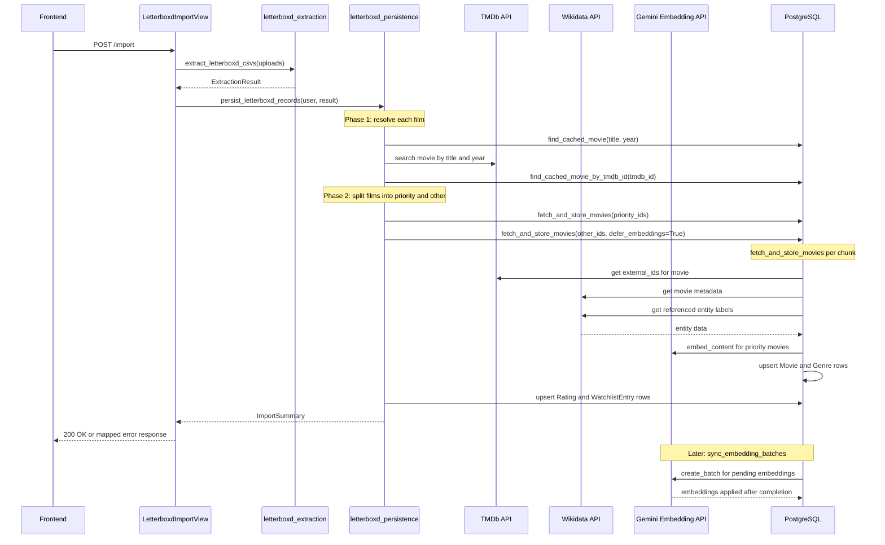
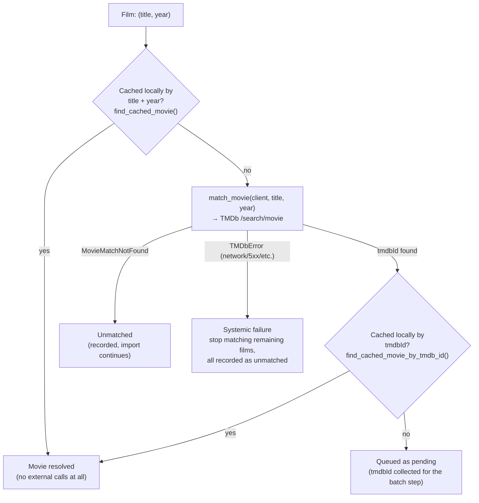
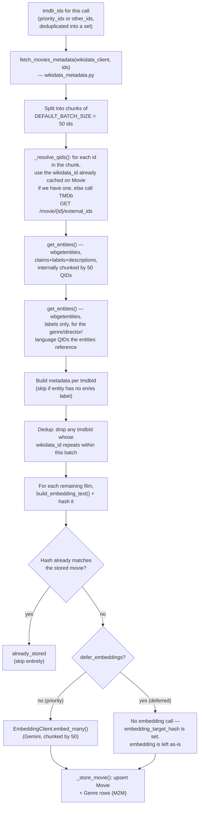

# Letterboxd Export Import Flow

This document walks through what actually happens, end to end, when a user uploads a
Letterboxd export: from the raw zip/CSV upload down to how each film gets its TMDb id,
its cached metadata, and (for the films that matter most) its embedding.

## At a glance

## Step by step

### 1. Upload and extraction

`LetterboxdImportView.post()` accepts either a single `file` (the Letterboxd zip export)
or one or more `files` (individual CSVs), and hands them to
`import_letterboxd_export()` → `extract_letterboxd_csvs()`.

Extraction (`letterboxd_extraction.py`) doesn't know anything about TMDb or Wikidata,
it just:
- detects a zip vs. standalone CSVs (by extension or by sniffing the `PK` magic bytes),
- decodes each file (`utf-8-sig` → `utf-8` → `latin-1` fallback),
- matches each file to one of the five canonical Letterboxd exports (`ratings.csv`,
  `diary.csv`, `watchlist.csv`, `watched.csv`, `likes/films.csv`) by filename,
- validates that each matched file still has the columns it's expected to have,
- and returns an `ExtractionResult`: a dict of `{canonical_name: rows}` plus a list of
  any expected files that weren't present.

### 2. Collecting film keys

`letterboxd_persistence._collect_film_keys()` and `_merge_rating_sources()` reduce all
of those CSV rows down to a single `set[(title, year)]` — one entry per distinct film
across `ratings.csv`, `diary.csv`, `liked/films.csv`, `watched.csv`, and
`watchlist.csv`. This is also where per-film data from multiple CSVs gets merged (e.g.
a film's rating and liked-status and diary watched-date can each come from a different
file, but they all resolve to the same `(title, year)` key).

This `(title, year)` set is what `_match_films()` then has to resolve to `Movie` rows —
**each distinct film is only ever matched once**, no matter how many CSV rows reference
it (a film in both `ratings.csv` and `watchlist.csv` is looked up a single time).

### 3. Resolving each film — the matching phase

This is the per-film loop inside `_match_films()`. For every `(title, year)`, in order:

**How `match_movie()` picks a `tmdbId`** (`tmdb_matching.py`):

1. Search TMDb (`/search/movie`) with `query=title` and `primary_release_year=year`.
2. If that comes back empty and a year was given, retry the same search **without**
   the year constraint (a common cause of an otherwise-solid title getting zero
   results).
3. From whatever results came back, keep only the candidates within `±1` year of the
   requested year (`YEAR_TOLERANCE`) — or, if none survive that, fall back to the full
   result set rather than failing outright.
4. Within that pool, prefer candidates whose title matches **exactly** once both are
   normalized (lowercased, punctuation/spaces stripped) — this is what stops "Dune:
   Part One" from stealing a plain "Dune" match when both appear in the same year.
5. Break any remaining tie by TMDb `popularity`, descending.
6. If more than one candidate survived step 4, the match is flagged `is_ambiguous`
   (logged, not currently surfaced to the end user — see *Known limitations* below).

If nothing at all matches, `match_movie()` raises `MovieMatchNotFound` and that one
film is recorded as unmatched **without** stopping the rest of the import. If TMDb
itself is unreachable or rate-limited (`TMDbError`/`TMDbRateLimitedError`), matching
stops for the *entire* import from that point on — every remaining film is recorded
as unmatched too, since there's no point hammering a TMDb that's already failing.

Note what **doesn't** happen in this phase: no `Movie` row is created yet just because
a `tmdbId` was found. A fresh `tmdbId` only ever gets queued as *pending* — the actual
row is only written once its Wikidata metadata is resolved, in phase 4.

**One extra thing happens alongside the match/cache lookup in this same loop:** every
film that resolves — whether it was already cached (by title+year or by tmdbId) or
freshly matched — gets checked against `priority_keys` (see step 4 below) and, if it's
a priority film that's still missing an embedding (`_needs_embedding()`: no `embedding`
and no `embedding_batch_id`), its tmdb id is added to `priority_ids`. This means an
already-cached movie can still end up back in front of Wikidata/Gemini if it happens
to be one of this import's priority films and was never embedded.

### 4. Splitting resolved films by priority

Before the batch step runs, `persist_letterboxd_records()` decides which resolved
films get their embedding computed **synchronously, as part of this import**, and
which get deferred to the async batch pipeline (step 6):

1. Take every film that has a rating (from `_merge_rating_sources()`), sort it by
   `(liked, rating)` descending — liked films first, then by rating — and keep the top
   `settings.RECOMMENDATION_MAX_HISTORY_MOVIES` as `priority_keys`.
2. During the matching loop (step 3), every resolved film that's in `priority_keys`
   and still needs an embedding contributes its tmdb id to `priority_ids`.
3. Every other tmdb id that was freshly matched (i.e. `pending`, not already cached)
   but isn't in `priority_ids` becomes `other_ids`.
4. `priority_ids` is passed to `fetch_and_store_movies()` normally (embeddings
   computed inline, synchronously, via Gemini). `other_ids` is passed with
   `defer_embeddings=True` — metadata is still fetched and the `Movie` row is still
   written, but the embedding call is skipped and the row is left for the async batch
   job to pick up later.

The point of this split is to keep the import request itself fast: only the handful
of films that actually drive this user's recommendations right away pay the cost of a
synchronous Gemini call during the request; a 500-film import doesn't turn into 500
sequential embedding calls.

### 5. Resolving metadata — the batched Wikidata + embedding phase

`fetch_and_store_movies()` (`movie_cache.py`) is what both the priority and the
deferred calls above go through. For a given set of tmdb ids:

A few things worth calling out here:

- **QID resolution.** Each `tmdbId` first checks whether the local `Movie` row 
  already has a `wikidata_id` cached; only the ones that don't get a live lookup, 
  that lookup is a **per-movie** TMDb call (`/movie/{id}/external_ids`), not a 
  batched one. On a warm cache (most re-imports, and any film TMDb/Wikidata has 
  already resolved for another user) this step barely runs at all.
- **The actual Wikidata calls are batched via `wbgetentities`.**
  Once QIDs are known, `WikidataClient.get_entities()` fetches `claims`, `labels`, and
  `descriptions` for up to `MAX_ENTITIES_PER_REQUEST = 50` QIDs per request. A second,
  smaller batch of `get_entities()` calls resolves just the labels for whatever
  genre/director/language QIDs those entities reference.
- **A `tmdbId` with no Wikidata coverage is not a failure.** It's entirely normal for a
  niche or very new title to have a TMDb page but no corresponding Wikidata item yet
  (or no `external_ids.wikidata_id` at all). That film is recorded as *matched, but
  without metadata* (`without_metadata`) — its Rating/WatchlistEntry rows are still
  created, just without a linked `Movie`.
- **Two movies never end up pointing at the same Wikidata item.** If a batch's
  metadata resolves two different `tmdbId`s to the same `wikidata_id`, the second one
  is dropped rather than stored — this guards against a bad TMDb/Wikidata
  cross-reference silently merging two distinct films.
- **Re-imports don't re-embed unchanged movies.** Each film's `build_embedding_text()`
  output is hashed; if the stored movie's `embedding_source_hash` already matches
  (or, for a deferred call, `embedding_target_hash` already matches — i.e. it's
  already queued with this exact text), the film is counted as `already_stored` and
  nothing is recomputed.
- **Priority films get their embedding inline; everything else just gets a
  `Movie` row.** For a deferred film, `_store_movie()` still writes the metadata and
  sets `embedding_target_hash`, but leaves `embedding`/`embedding_source_hash` alone
  — that's exactly what marks it as pending for the batch job below.

### 6. What happens to deferred embeddings

Films that went through step 5 with `defer_embeddings=True` end up with a `Movie` row
that has metadata but no (or a stale) embedding. They're picked up later, outside the
import request entirely, by the `sync_embedding_batches` management command
(`embedding_batch.py`):

- `pending_movies_queryset()` selects every `Movie` with no `embedding_batch` set and
  either no `embedding` at all, or a stale one (`embedding_source_hash` doesn't match
  `embedding_target_hash`).
- `submit_pending_embeddings_batch()` takes a page of those (respecting
  `EMBEDDING_BATCH_MAX_ITEMS` and the remaining `api_quota` budget), submits them as a
  single Gemini batch job (`EmbeddingClient.create_batch()`), and marks those movies as
  belonging to that `EmbeddingBatchJob` so they aren't picked up again.
- `collect_finished_batches()` polls submitted jobs; once a job is done, it applies
  each returned vector back onto its `Movie` (only if the row's `embedding_target_hash`
  hasn't changed out from under it in the meantime), and releases movies whose
  embedding failed so they're eligible to be resubmitted.

So a large import's "long tail" of films still gets embedded — just asynchronously.

### 7. Persisting Ratings and Watchlist entries

Back in `persist_letterboxd_records()`, the now-complete `{(title, year): Movie}`
mapping from steps 3–5 is handed to `persist_ratings()` and `persist_watchlist()`,
which upsert one `Rating`/`WatchlistEntry` row per film per user (`update_or_create`
keyed on `user` + `title` + `release_year`, so re-importing an updated export just
refreshes the existing rows instead of duplicating them). Each row's `movie` foreign
key is `movie_matches.get(key)` — `None` when the film was never resolved to a
`Movie` in the previous phases, which is exactly what the model's `0..1` cardinality
documents.

**## Why the priority split matters**

The priority/deferred split addresses a separate cost: embedding generation. Fetching metadata for every film in an import is one thing, but calling Gemini synchronously for every one of them would make a large import's response time scale with its size and consume a large number of embedding tokens.

Capping the synchronous embedding work at the top `RECOMMENDATION_MAX_HISTORY_MOVIES` films — the ones that actually feed recommendations most directly — keeps import latency roughly constant and avoids spending embedding tokens unnecessarily on less relevant history. The async batch pipeline (step 6) catches up on the rest without anyone waiting on it.