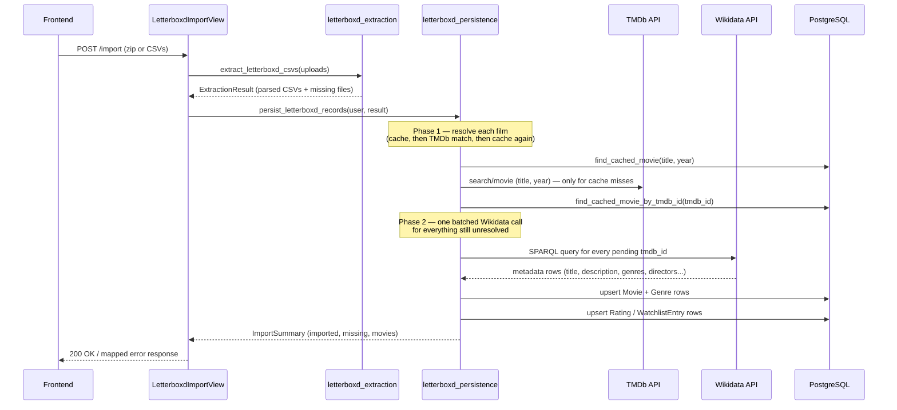
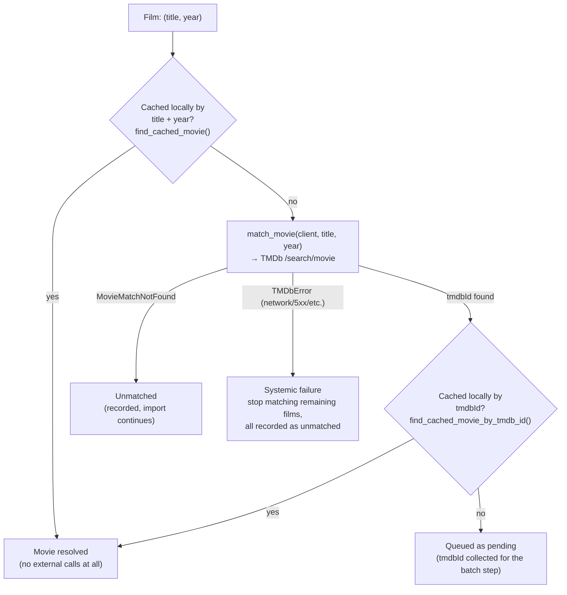
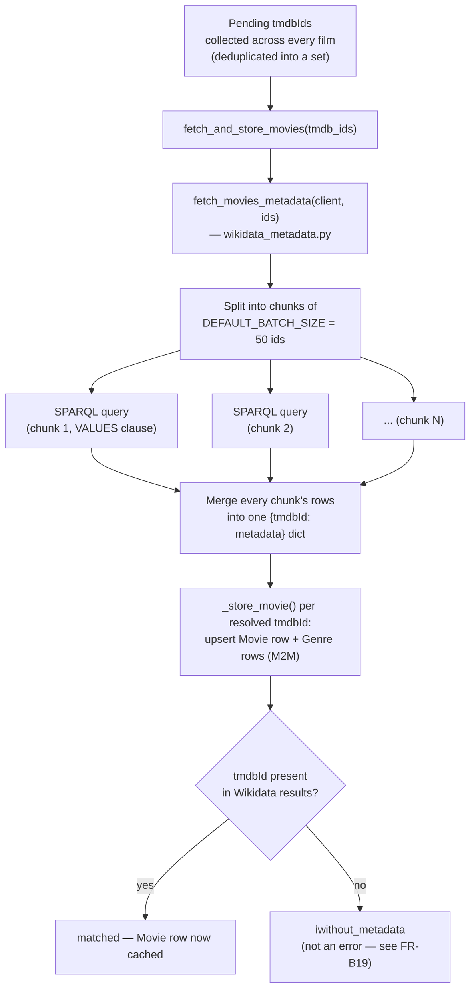

# Letterboxd Export Import Flow

This document walks through what actually happens, end to end, when a user uploads a
Letterboxd export: from the raw zip/CSV upload down to how each film gets its TMDb id
and its cached metadata.

## At a glance

## Step by step

### 1. Upload and extraction

`LetterboxdImportView.post()` accepts either a single `file` (the Letterboxd zip export)
or one or more `files` (individual CSVs), and hands them to
`import_letterboxd_export()` → `extract_letterboxd_csvs()`.

Extraction (`letterboxd_extraction.py`) doesn't know anything about TMDb or Wikidata,
it just:
- detects a zip vs. standalone CSVs (by extension or by sniffing the `PK` magic bytes),
- decodes each file (`utf-8-sig` → `utf-8` → `latin-1` fallback),
- matches each file to one of the five canonical Letterboxd exports (`ratings.csv`,
  `diary.csv`, `watchlist.csv`, `watched.csv`, `likes/films.csv`) by filename,
- validates that each matched file still has the columns it's expected to have,
- and returns an `ExtractionResult`: a dict of `{canonical_name: rows}` plus a list of
  any expected files that weren't present.

### 2. Collecting film keys

`letterboxd_persistence._collect_film_keys()` and `_merge_rating_sources()` reduce all
of those CSV rows down to a single `set[(title, year)]` — one entry per distinct film
across `ratings.csv`, `diary.csv`, `liked/films.csv`, `watched.csv`, and
`watchlist.csv`. This is also where per-film data from multiple CSVs gets merged (e.g.
a film's rating and liked-status and diary watched-date can each come from a different
file, but they all resolve to the same `(title, year)` key).

This `(title, year)` set is what `_match_films()` then has to resolve to `Movie` rows —
**each distinct film is only ever matched once**, no matter how many CSV rows reference
it (a film in both `ratings.csv` and `watchlist.csv` is looked up a single time).

### 3. Resolving each film — the matching phase

This is the per-film loop inside `_match_films()`. For every `(title, year)`, in order:

**How `match_movie()` picks a `tmdbId`** (`tmdb_matching.py`):

1. Search TMDb (`/search/movie`) with `query=title` and `primary_release_year=year`.
2. If that comes back empty and a year was given, retry the same search **without**
   the year constraint (a common cause of an otherwise-solid title getting zero
   results).
3. From whatever results came back, keep only the candidates within `±1` year of the
   requested year (`YEAR_TOLERANCE`) — or, if none survive that, fall back to the full
   result set rather than failing outright.
4. Within that pool, prefer candidates whose title matches **exactly** once both are
   normalized (lowercased, punctuation/spaces stripped) — this is what stops "Dune:
   Part One" from stealing a plain "Dune" match when both appear in the same year.
5. Break any remaining tie by TMDb `popularity`, descending.
6. If more than one candidate survived step 4, the match is flagged `is_ambiguous`
   (logged, not currently surfaced to the end user — see *Known limitations* below).

If nothing at all matches, `match_movie()` raises `MovieMatchNotFound` and that one
film is recorded as unmatched **without** stopping the rest of the import. If TMDb
itself is unreachable or rate-limited (`TMDbError`/`TMDbRateLimitedError`), matching
stops for the *entire* import from that point on — every remaining film is recorded
as unmatched too, since there's no point hammering a TMDb that's already failing.

Note what **doesn't** happen in this phase: no `Movie` row is created yet just because
a `tmdbId` was found. A fresh `tmdbId` only ever gets queued as *pending* — the actual
row is only written once its Wikidata metadata is resolved, in phase 2.

### 4. Resolving metadata — the batched Wikidata phase

Once the per-film loop above has run for *every* film, `_match_films()` looks at
everything that ended up `pending` (i.e. every `tmdbId` that wasn't already cached by
title/year or by id) and resolves all of it together:

A few things worth calling out here:

- **One request per import (or a handful, for very large ones), not one per movie.**
  Wikidata items declare their TMDb id via the `P4947` property, so a single SPARQL
  query with a `VALUES ?tmdbId { "1" "2" "3" ... }` clause can resolve dozens of movies
  at once. `DEFAULT_BATCH_SIZE = 50` caps how many ids go into a single query, to stay
  well inside Wikidata's practical query-size/timeout limits — a 200-film import means
  4 SPARQL calls instead of 200.
- **A `tmdbId` with no Wikidata coverage is not a failure.** It's entirely normal for a
  niche or very new title to have a TMDb page but no corresponding Wikidata item yet.
  That film is recorded as *matched, but without metadata* — its Rating/WatchlistEntry
  rows are still created, just without a linked `Movie` (see the data model's note on
  `Movie "0..1" --> Rating/WatchlistEntry`).
- **Cast/actors are deliberately not part of this query.** An earlier version of the
  Wikidata query also pulled each movie's cast list (`P161`). That subquery was
  noticeably more expensive and started causing timeouts, especially once many movies
  are resolved in the same batched request — so it was dropped. `directors` (`P57`,
  much smaller — effectively always one or two values) was kept.
- **Genre rows are reused, not duplicated.** `_store_movie()` calls
  `Genre.objects.get_or_create(wikidata_id=...)` per genre, so two movies sharing a
  genre in the same batch (or across different imports/users entirely) reuse the same
  `Genre` row.

### 5. Persisting Ratings and Watchlist entries

Back in `persist_letterboxd_records()`, the now-complete `{(title, year): Movie}`
mapping from steps 3–4 is handed to `persist_ratings()` and `persist_watchlist()`,
which upsert one `Rating`/`WatchlistEntry` row per film per user (`update_or_create`
keyed on `user` + `title` + `release_year`, so re-importing an updated export just
refreshes the existing rows instead of duplicating them). Each row's `movie` foreign
key is `movie_matches.get(key)` — `None` when the film was never resolved to a
`Movie` in the previous phase, which is exactly what the model's `0..1` cardinality
documents.

## Why the batching matters

Before this split existed, every film that missed both cache checks triggered its own
individual Wikidata SPARQL request — a several-hundred-film import meant several
hundred sequential (rate-paced) round trips to Wikidata, which is slow and was the
direct cause of the timeouts mentioned above. Separating "which films need
resolving" (cheap, local) from "resolve them" (expensive, external) makes it possible
to fetch all of them together, cutting the request count from *O(unresolved films)* to
*O(unresolved films ÷ 50)*.